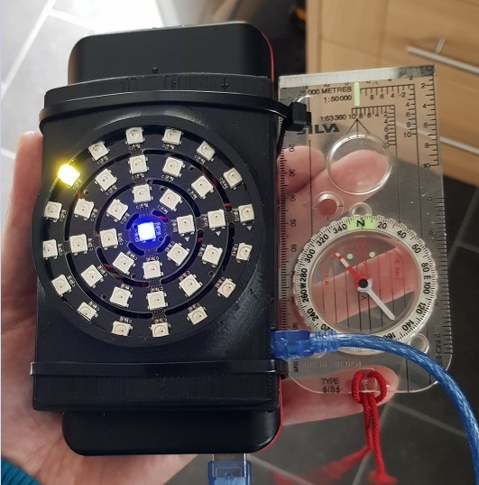

# Video game radar IRL
While participating in Airsoft, I needed a way to find my allys. So I went about making a radar for me to locate them.

## A work in progress
I decided I would use mobile phones to run the software so have started my journey into android app development. However I am a complete beginner still!

The overview:
Use a mobile's location data to send to a server via roaming data. Then receive the poisiton of all my allys.
Then send those values to an ardino.
The arduino then calculates the differnce between all the locations into polar co-ordinates.
The co-ordinates are then displayed on a ring of LEDs.
The LED ring then gets indexed based on a heading from a digital compass attched to the arduino.

So, just the average project really.. >_>
